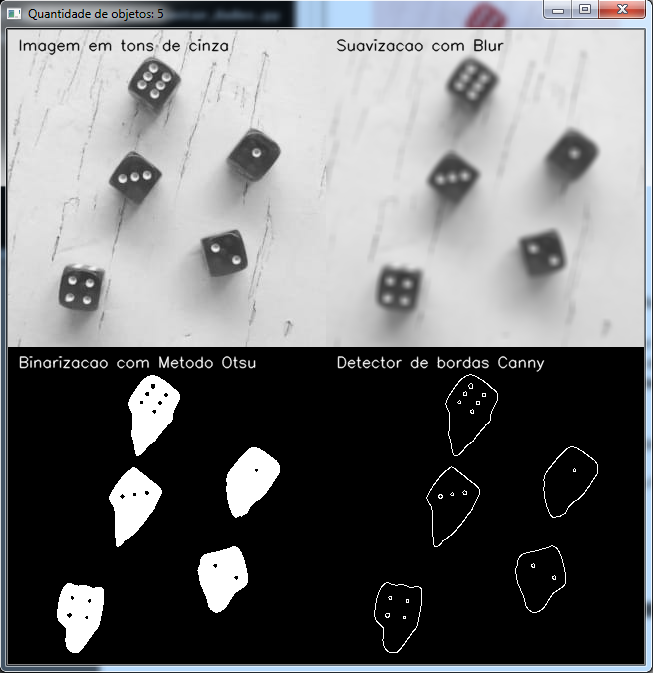
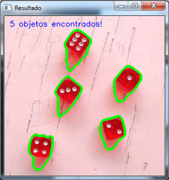

# Trabalho de Multimídia

## Contando dados na imagem

### Tela 01

- Nessa janela são apresentadas quatro imagens, correspondendo aos filtros usados, sendo estes: Tons de cinza; Filtro Blur; Binarização usando o Método Otsu; e Detecção de bordas Canny.

### Tela 02

- Essa janela apresenta a imagem original com o contorno dos dados identificados pelo algorítmo.

## Situação com viabilidade da utilização de visão computacional

- Sabemos que em supermercados e hipermercados, onde há um grande fluxo de pessoas, formam-se grandes filas nos caixas. A utilização de teclogias de visão computacional nas imagens das câmeras de segurança pode proporcionar uma melhor distribuição dessas filas, permitindo observar facilmente quais filas estão menores ou maiores, tempo médio de espera por cliente, tempo de atendimento, entre outas informações relevantes para a equipe de gerência da empresa. O fornecimento de tais informações permite o estudo de formas para melhor distribuir os clientes nos caixas, ou mesmo de melhorias no atendimento em geral.
